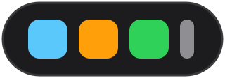

<p align="center">
  
</p>

<p align="center">
  
  
  
</p>


# DochkaDock

DochkaDock is a macOS style dock for Windows 11. It is a floating pill of large icons
that sits just above the taskbar. Pin your favorite apps, click to launch or switch to
them, drag to reorder, and hover over an icon to see it grow, the same way the dock
works on a Mac.

It was built from scratch for one simple reason: most Windows dock tools bundle
adware or unrelated extras. DochkaDock has no third party dependencies beyond the
.NET and WPF runtime that Windows itself provides.

## What it does

At its core, DochkaDock is a pinned app launcher. On top of that, it adds a set of
small productivity features:

- **Click to focus, not relaunch.** If a pinned app is already running, clicking its
  icon switches to it instead of opening a second copy.
- **Drag and drop to open.** Drop a file onto an app icon to open that file with that
  app.
- **Drop Actions.** Define your own drag and drop commands, for example "compress this
  image" or "convert this file", using simple placeholders like `{file}` and `{name}`.
- **Workspaces.** Group a set of apps together and launch (or focus) all of them with
  one click. Up to 5 workspaces can be pinned.
- **Window position memory.** Save where a window should appear (position, size,
  monitor, maximized or not) and have it reopen there every time.
- **A small shelf.** A place to drop files and keep a short clipboard history during
  the current session.
- **Recent documents.** See the recent files of a running app directly from its dock
  icon.
- **Media mini controls.** See what is playing and control play, pause, next and
  previous from the dock, for apps that support it.
- **Windows Recovery Toolkit.** One click actions for common fixes: restart Explorer,
  flush DNS, release or renew your IP, restart the audio service, or open Device
  Manager and Services.
- **Auto hide.** The dock can hide itself and reappear when you move the mouse to the
  bottom of the screen, like the Windows taskbar.
- **Dock themes.** Pick Default, WaterGlass, or DarkGlass from the gear menu to change
  how icons look, a translucent glass tile behind each one in blue or near black. The
  change applies instantly and is remembered for next time.
- **Remote Desktop aware.** The dock stays off a Remote Desktop session entirely: it
  hides itself when your PC is being viewed remotely, and also hides on the PC you are
  viewing from so it never overlaps a Remote Desktop window.
- **Recycle Bin icon.** Drop a file on it to send it to the Recycle Bin (recoverable,
  not a permanent delete).
- **12 languages.** English, French, German, Dutch, Italian, Spanish, Portuguese,
  Simplified Chinese, Traditional Chinese, Russian, Japanese and Korean, switchable
  from the tray menu.

To keep the dock usable, pinned items are capped at 20 icons in total, and workspaces
are capped at 5.

## System requirements

- Windows 10 version 2004 (build 19041) or later, or Windows 11. The app is built and
  tested primarily on Windows 11.
- 64 bit (x64) processor.
- [.NET 8 Desktop Runtime](https://dotnet.microsoft.com/download/dotnet/8.0). This is
  a small, free, one time install from Microsoft, shared by any .NET app on your
  machine. If it is missing, Windows will show a prompt with a download link the first
  time you run DochkaDock.

DochkaDock itself is a single, small executable file. There is no separate installer
and nothing is written to the Windows registry except an optional "start with
Windows" entry, which you can turn on or off from the tray menu.

## Getting started

1. Make sure the .NET 8 Desktop Runtime is installed (see above).
2. Download or build `DochkaDock.exe` (see "Building from source" below).
3. Run it. A small icon appears in the system tray, and the dock appears above the
   taskbar.
4. Right click the tray icon, or the small gear icon at the end of the dock, to add
   applications, change settings, or pick a language.

Your dock layout and settings are stored in a single file at
`%AppData%\DochkaDock\config.json`. You can open that folder directly from the tray
menu.

## Building from source

You need the .NET 8 SDK (not just the runtime) to build the app.

```powershell
# Quick build to try it out locally:
cd src\DochkaDock
dotnet build -c Debug
dotnet run

# Build the final, single file .exe (same one described above):
.\publish.ps1
```

The published file appears at `publish\DochkaDock.exe`.

## How it is built

DochkaDock is written in C# using WPF (Windows Presentation Foundation), which is
Microsoft's own toolkit for building Windows desktop apps. There are no third party
packages. When WPF does not offer something the app needs, such as reading an
application's icon or managing the system tray, the code talks to Windows directly
through its native programming interface (the same low level interface Windows itself
is built on).

The project is organized into a few simple parts:

- **The main window** is the dock itself. It handles where the dock sits on screen,
  the hover and magnify animation, drag and drop, and what happens when you click an
  icon.
- **Services** are small, focused helper classes, each responsible for one job: reading
  an app's icon, finding installed apps, keeping track of which apps are running,
  reading and saving the configuration file, and so on.
- **Models** are simple data shapes describing what is pinned to the dock and what
  gets saved to disk.
- **A few small editor windows** let you add an application, set up a Drop Action, or
  build a Workspace.
- **Language files** are plain text files, one per language, built directly into the
  program so nothing extra needs to be installed alongside it.

The app deliberately avoids depending on other libraries so that the final file stays
small, easy to inspect, and free of anything unrelated to what it actually does.

## Known limitations

- The app picker finds installed apps by looking at Start Menu shortcuts. A handful of
  apps without a traditional shortcut will not show up there, but can still be added
  through the "browse for a file" option.
- The dock is designed for a single monitor setup. It has not been tested for
  multi-monitor positioning.
- Auto hide only reacts to the mouse reaching the bottom of the screen. There is no
  keyboard shortcut to bring the dock back yet.
- Recent documents only show for an app that is currently running, since that
  information comes from the running app itself.
- Media controls only work for apps that register themselves with Windows as a media
  source. Not every app does this.

## Privacy

DochkaDock does not collect any personal information or usage data, and there is no
analytics or tracking of any kind. There is no account, no sign in, and no
registration. It is completely free to use.

The app makes no network or internet calls on its own. All of its features, including
pinning apps, Drop Actions, Workspaces, the shelf, media controls, and the Recovery
Toolkit, work entirely with files and Windows features already on your machine. The
only network addresses anywhere in the app are the GitHub and license links in the
About window, and those only open your web browser if you click them yourself.

Your dock layout and settings stay in a single local file on your own machine, at
`%AppData%\DochkaDock\config.json`. Nothing is ever sent anywhere.

## License

DochkaDock is released under the PolyForm Noncommercial License 1.0.0. You are free to
use, study and modify it for personal, educational or other noncommercial purposes.
Commercial use requires the author's separate permission. See the [LICENSE](LICENSE)
file for the full text.

## Author

Michael DALLA RIVA
